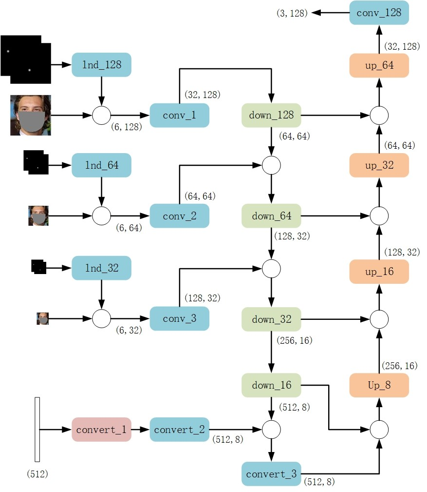
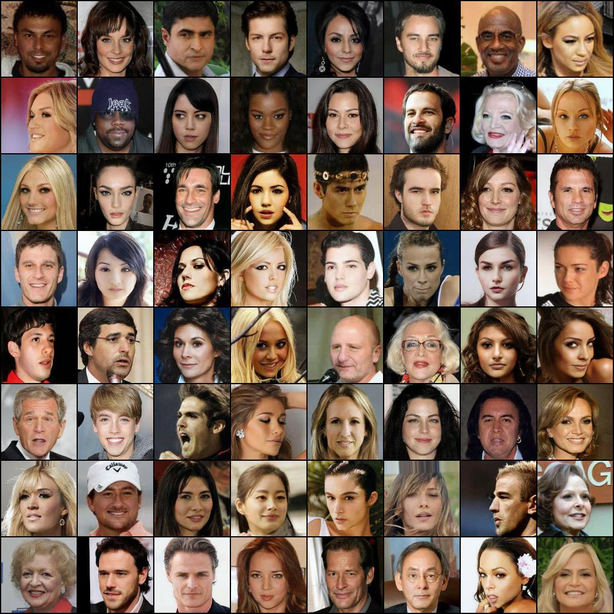
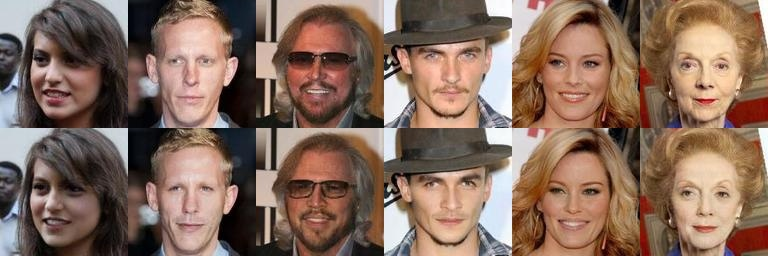
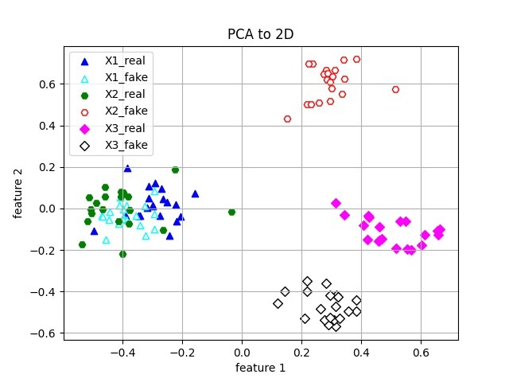

# Face_Anonymization
使用生成对抗网络对人脸身份信息进行去隐私编辑。人脸图像经过网络处理后，人脸的身份信息发生改变，其他信息得以保留，整个过程中需要使用生成对抗网络的生成能力改变人脸区域，同时利用人脸识别网络编码指导人脸区域的生成。

网络的输入包含三个部分：目标图像，去除部分人脸区域后的原图像和原图中人脸特征点热图。生成器的损失包含三个部分，对抗损失，去身份识别损失和重建损失。使用VGG-Face2作为训练数据集，完成训练后对CelebA数据集进行处理，示例如下，

与原始图像对比如下：

从视觉上看原身份信息与生成的身份信息已发生改变，使用FaceNet网络对前后图像提取身份特征向量，然后进行降维可视化，如图

生成图像的身份信息已经明显可分，达到了去除身份信息的目标，能够对图像中的身份信息进行保护。

训练权重链接：https://pan.baidu.com/s/1w7c75RGl5BalcLWEJk7bxw ，提取码：9wrr

将下载好的权重信息放到`Face_Anonymization`目录下，若需要训练自己的网络模型，根据`dataset`文件夹下的示例准备训练数据集。训练脚本为`training.py`，单张图像测试脚本为`main.py`。

> https://github.com/ronghuaiyang/arcface-pytorch
>
> https://github.com/YuvalNirkin/fsgan
>
> https://github.com/dvl-tum/ciagan

